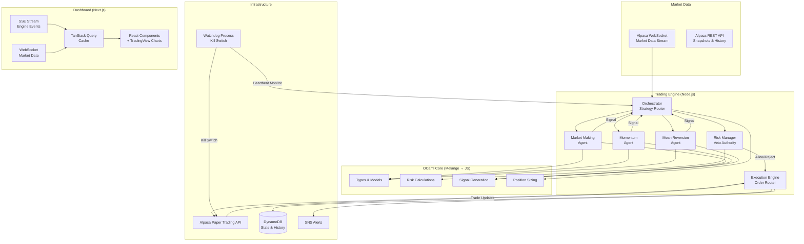
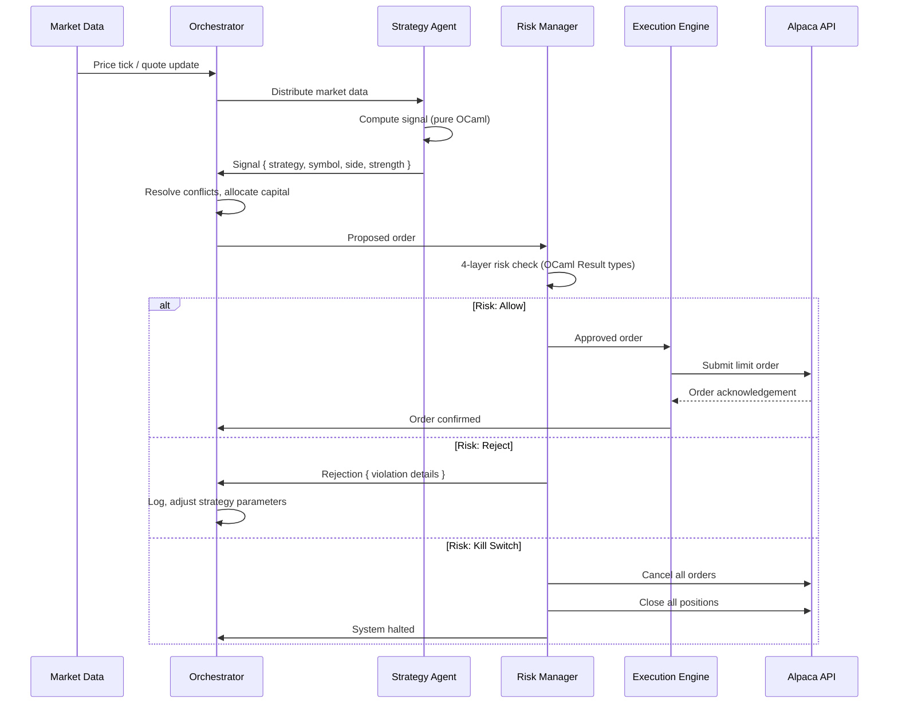

# Autonomous Multi-Strategy Trading Agent (Jane Street Style)

## Overview

Build a fully autonomous trading agent that runs 24/7 on Alpaca paper trading, combining market making, momentum, and mean reversion strategies with dynamic capital allocation. The system uses OCaml (compiled via Melange to JS and native) for type-safe trading logic following Jane Street patterns, with a Next.js real-time monitoring dashboard. This builds on the existing Omaha Oracle infrastructure (see origin), extending it from a research/analysis platform into an autonomous execution system.

## Problem Frame

The existing Omaha Oracle system performs fundamental analysis, generates investment theses, and executes trades — but requires human-in-the-loop decision making. The user wants a fully autonomous agent that:

1. Continuously monitors markets and generates trading signals across multiple strategies
2. Manages risk autonomously with hard circuit breakers and a kill switch
3. Executes trades on Alpaca paper trading to validate strategies before any live deployment
4. Provides real-time visibility via a Next.js dashboard
5. Uses Jane Street-style functional programming for correctness by construction

## Requirements Trace

- R1. Multi-strategy engine: mean reversion, sector rotation, calendar/seasonal (Micro phase), momentum (Small phase), market making (Medium phase) with dynamic allocation
- R2. Fully autonomous 24/7 operation with no human approval needed for trades
- R3. Layered risk management: pre-trade checks, position limits, portfolio limits, circuit breakers, kill switch, PDT tracking
- R4. Alpaca paper trading integration with real-time WebSocket market data and order updates
- R5. OCaml/Melange type-safe trading core: make illegal states unrepresentable
- R6. Next.js real-time dashboard with live positions, PnL, strategy metrics, risk status
- R7. Continuous strategy performance tracking with dynamic capital reallocation
- R8. Self-improvement loop: learn from trade outcomes and adjust strategy parameters
- R9. Account phase awareness: system scales strategy complexity and position sizing with account balance, starting from $1,000

## Scope Boundaries

- Paper trading ONLY — no live trading capability in this phase
- Equities only — no options, crypto, or forex
- No LLM-based trading decisions (strategies are quantitative/rule-based, not AI-generated)
- No mobile app — web dashboard only
- Reuses existing Omaha Oracle AWS infrastructure (DynamoDB, S3, Lambda) where practical
- Does NOT replace the existing Omaha Oracle analysis pipeline — this is a separate system that may consume its outputs

## Context & Research

### Relevant Code and Patterns

**From Omaha Oracle (existing codebase at `C:\Users\peder\Documents\omaha_oracle\`):**
- `src/portfolio/allocation/position_sizer.py` — Half-Kelly criterion (116 lines, pure function)
- `src/portfolio/allocation/buy_sell_logic.py` — Buy/sell evaluation with gates (209 lines)
- `src/portfolio/risk/guardrails.py` — Hard risk limits, sector checks, budget checks (151 lines)
- `src/dashboard/alpaca_client.py` — Working Alpaca SDK wrapper (TradingClient)
- `src/dashboard/alpaca_models.py` — AccountSummary, PositionInfo, OrderInfo dataclasses
- `src/backtesting/engine.py` — Backtest simulation with Sharpe/Sortino/Calmar metrics
- `src/analysis/quant_screen/` — Piotroski F-score, quantitative screening (pure computation)
- `src/analysis/intrinsic_value/handler.py` — DCF + EPV + asset floor composite valuation
- `src/shared/config.py` — Pydantic Settings with SSM Parameter Store fallback
- `src/monitoring/owners_letter/handler.py` — Quarterly self-improvement loop with lesson extraction

**Architecture patterns to preserve:**
- Pure function model: core logic has no side effects, all I/O isolated in handlers
- Pydantic for configuration and data validation
- DynamoDB for state persistence with on-demand capacity and PITR
- SNS for alerting (trade executions, errors, circuit breaker triggers)

### External References

- **Alpaca API v2**: REST + WebSocket, paper trading at `paper-api.alpaca.markets`, 200 req/min rate limit, bracket orders for built-in risk management
- **Melange 5.0** (March 2025): OCaml to JS compiler, `@mel.as`/`@mel.tag` for discriminated unions, NPM runtime package, integrates with Dune 3.8+
- **Next.js 15 App Router**: Server Components for initial loads, Client Components for WebSocket connections, Route Handlers for SSE streaming
- **TanStack Query v5**: `setQueryData` for WebSocket-driven cache updates, `staleTime: Infinity` for socket-fed queries
- **Jane Street patterns**: Sum types for state machines, Result types for error handling, exhaustive pattern matching, Incremental for real-time recomputation

## Key Technical Decisions

- **Trading engine runtime: Node.js (TypeScript) with Melange-compiled OCaml modules** — Rationale: Alpaca has a maintained JS SDK (`@alpacahq/alpaca-trade-api`), WebSocket handling is native to Node.js, and Melange compiles OCaml to ES modules consumable by both the engine and the Next.js dashboard. This avoids maintaining separate Python and OCaml runtimes. The OCaml modules handle all computation; TypeScript handles I/O (Alpaca API, WebSocket, persistence). **Module system:** Melange outputs ESM; `@alpacahq/alpaca-trade-api` is CommonJS. Engine uses `"type": "module"` in package.json with dynamic `import()` for CJS dependencies, or a bundler (esbuild) to resolve the mismatch. Verify in Unit 1. **Boundary contract:** Melange output becomes plain JS objects in TypeScript — the type safety ends at the FFI boundary. A validation layer (Zod or io-ts) must validate OCaml-produced values at the TypeScript boundary to preserve correctness guarantees across runtimes. **Testing strategy:** OCaml property-based tests require a native build target (Jane Street's ppx_quickcheck does not compile under Melange). Maintain a minimal native test build alongside the Melange production build — tests run native, production compiles to JS. Alternatively, use fast-check (JS property testing library) on the Melange output.

- **Account phase system: strategies scale with balance** — Rationale: Starting balance is $1,000. The existing Omaha Oracle `min_position_usd = $2,000` is LARGER than the entire account, making all trading impossible with current defaults. Alpaca supports fractional shares (min $1 notional), so small positions are technically viable. **Decision:** Implement an account phase system that automatically adjusts strategy enablement, position sizing, and risk limits based on current equity:
  - **Micro (<$2,500):** Mean reversion + Sector rotation + Calendar/seasonal overlay. 2-3 max positions. Min position = max($50, 5% of equity). Position sizing via notional orders (not share qty). PDT constraint: max 3 day trades per 5 business days (swing trading avoids this). Symbol universe: 3-5 large-cap stocks for mean reversion + 11 sector ETFs (XLK, XLF, XLE, XLV, XLI, XLU, XLC, XLP, XLB, XLRE, XLY) for rotation. Capital split: 50% mean reversion, 30% sector rotation, 20% calendar/cash.
  - **Small ($2,500-$10,000):** Add Momentum. 4-6 max positions. Min position = max($125, 3% of equity). Basic VIX regime detection. Symbol universe expands to 8-12 stocks. Capital split adjusts by regime.
  - **Medium ($10,000-$25,000):** Add Market making (signal-only, PnL flagged unvalidated). 8-12 max positions. Min position $500. Full regime detection. PDT still applies (max 3 day trades).
  - **Standard ($25,000+):** Full multi-strategy. PDT unlocked (4x intraday buying power). Original plan parameters (min $2,000, max 20 positions).
  Phase transitions are automatic based on Alpaca account equity, checked every 60 seconds via config poll.

- **Market making strategy: disabled at small account sizes, paper-only with offline validation** — Rationale: Market making requires capital on both sides (bid/ask) for each symbol, and paper fills have no queue position/adverse selection/depth simulation. At $1,000, a $100 quote on each side leaves nothing for other strategies. **Decision:** Market making is disabled in Micro and Small phases. Enabled at Medium phase ($10K+) for signal generation exercising, but paper PnL is flagged as "unvalidated." For true validation, use offline L2 order book replay. Additionally, fractional shares cannot be sold short, which further limits market making at small scale.

- **Strategy architecture: Agent Pool with fixed-tick collection** — Rationale: Each strategy is an independent module that emits typed Signal values. An Orchestrator collects signals, resolves conflicts, and routes through the Risk Manager before the Execution Engine. No shared mutable state between strategies. **Temporal model:** The Orchestrator operates on a fixed tick (configurable, default 1 second). On each tick, it collects whatever signals have arrived since the last tick. If a strategy misses a tick (crash, slow computation), the Orchestrator proceeds without it and logs the miss. After 3 consecutive misses, the strategy is marked unhealthy and its allocation is redistributed. This avoids barrier-based deadlocks where a slow strategy blocks the entire pipeline.

- **Risk management: 4-layer defense with bidirectional heartbeat** — Rationale: The kill switch must work even if the trading engine hangs. A separate watchdog process monitors heartbeats and can cancel all orders + flatten positions via Alpaca API independently. **Bidirectional heartbeat:** The engine proves it is alive to the watchdog (heartbeat every 5s), AND the watchdog proves it is alive to the engine (acknowledgment). If the engine does not receive a watchdog-alive signal for 30 seconds, it enters read-only mode (processes market data but submits no orders) until the watchdog is confirmed running. This prevents trading without a safety net.

- **State persistence: DynamoDB with strong consistency for trading state** — Rationale: Reuses existing Omaha Oracle infrastructure. On-demand capacity handles bursty trading activity. PITR provides recovery from any state corruption. **Consistency model:** Use strongly consistent reads for order state and position state tables (trading-critical). Use eventually consistent reads for performance metrics, trade history, and dashboard data (latency-tolerant). **Startup reconciliation:** On engine restart, always reconcile local state against Alpaca `GET /v2/orders` and `GET /v2/positions` before resuming trading. Alpaca is the source of truth for order/position state.

- **Inter-process communication: Local TCP sockets with shared secret** — Rationale: Engine, watchdog, and dashboard are three processes on one machine. Local TCP allows independent process lifecycle management (either side can restart). **All services bind to 127.0.0.1 only** (not 0.0.0.0). Engine exposes HTTP `/health` for watchdog heartbeat and `/events` (SSE) for dashboard. Watchdog exposes HTTP `/kill` for dashboard kill-switch trigger. **Auth:** Kill switch (`/kill`) and config-write endpoints require an `X-API-Key` header matching a shared secret from `.env` (`LOCAL_API_SECRET`). Read-only endpoints (`/health`, `/events`) do not require auth but are localhost-only. Dashboard Next.js binds to `localhost:3000`. No shared dependencies like Redis.

- **Build environment: WSL2 required for OCaml toolchain** — Rationale: OCaml/opam/Dune/Melange on native Windows is not production-ready (multiple known issues: `Path.drop_prefix` crash in Dune < 3.19, many opam packages fail on Windows, Core_unix incompatible). WSL2 provides a Linux environment for building OCaml modules. The Melange output is standard JS that runs natively on Windows Node.js. VS Code Remote-WSL provides seamless editing. Docker Compose (Unit 11) abstracts this entirely for deployment.

- **Dashboard: Next.js 15 + TanStack Query v5 + TradingView Lightweight Charts** — Rationale: Server Components for initial page loads, WebSocket pushes into TanStack Query cache for real-time updates, TradingView charts are purpose-built for financial data. **Dashboard is read-only with one exception:** the kill switch button. If the dashboard is down, trading continues normally. The dashboard must NOT be in the critical path for any trading operation.

- **Dual-target OCaml build: Melange (JS) only for initial phase** — Rationale: Originally planned as dual-target (Melange + native opam), but the native target adds toolchain complexity with no immediate use case. (see origin: playful-splashing-popcorn.md). **Decision:** Build only the Melange (JS) target initially. Add the native opam target in a future phase when there is a concrete need (e.g., high-frequency backtesting where Node.js performance is insufficient). This halves the build surface area.

## Open Questions

### Resolved During Planning

- **Q: Should the engine run in Python (reusing Omaha Oracle) or Node.js?**
  Resolution: Node.js. The Melange output is JS, Alpaca has a JS SDK, and WebSocket handling is native. The existing Python code provides reference implementations to port, not code to run directly.

- **Q: How to handle market hours for a "24/7" agent?**
  Resolution: The agent runs continuously but only trades during market hours (9:30 AM - 4:00 PM ET). Outside hours it processes data, recalculates signals, updates models, and prepares orders for the next session. The market making strategy only operates during market hours; momentum and mean reversion strategies can queue orders.

- **Q: Which Alpaca data feed?**
  Resolution: Start with IEX (free tier) for paper trading. Upgrade to SIP (all exchanges) only if strategy backtests show meaningful edge from full market data.

- **Q: Is market making viable on Alpaca paper trading?**
  Resolution: No — paper fills have no queue position, adverse selection, or depth simulation. Market making is retained for signal generation and risk management exercising, but paper PnL is flagged as "unvalidated." True validation requires offline L2 order book replay. (Resolved during deepening)

- **Q: Can the OCaml toolchain run on Windows?**
  Resolution: Not reliably. WSL2 is required for Dune/Melange builds. Melange JS output runs natively on Windows Node.js. (Resolved during deepening)

- **Q: How should the Orchestrator collect signals — barrier (wait for all) or fixed-tick?**
  Resolution: Fixed-tick (default 1 second). Collect whatever signals have arrived, proceed without missing strategies. Avoids deadlocks from slow strategies. (Resolved during deepening)

- **Q: What DynamoDB consistency model for trading state?**
  Resolution: Strongly consistent reads for order/position tables. Eventually consistent for metrics/history. Startup reconciliation against Alpaca as source of truth. (Resolved during deepening)

- **Q: What are reasonable default strategy parameters?**
  Resolution: Research-grounded defaults (all tunable via config):
  - **Momentum:** EMA 12/26 crossover, 50/200 trend filter, RSI(14) 30/70, RVOL >= 1.5 for confirmation. Skip most recent month for formation period (Jegadeesh & Titman).
  - **Mean reversion:** Bollinger Bands(20, 2.0σ), z-score entry ±2.0, exit at 0, stop at ±3.0. ADF test (p<0.05) + Hurst exponent (H<0.5) on rolling 100-day window to confirm mean-reverting behavior. Target 5-15 day holding period.
  - **Market making:** Fair value from mid-price, spread = f(volatility), inventory skew adjustment. Parameters deferred since paper validation is limited.
  (Resolved during deepening — sources: Jegadeesh/Titman 1993, QuantifiedStrategies backtests, QuantStart)

- **Q: What market regime detection method?**
  Resolution: Phase 1: VIX thresholds (<15 low vol, 15-25 normal, 25-30 elevated, >30 crisis) + ADX overlay (<20 ranging, 20-40 moderate, >40 trending). Phase 2: upgrade to 2-state Hidden Markov Model on [daily returns, 20-day realized vol]. Regime-to-allocation matrix:
  - Low vol + trending: Momentum 50%, MeanRev 30%, MM 15%, Cash 5%
  - Normal: 40/40/15/5
  - High vol + ranging: 15/45/10/30
  - Crisis (VIX>30): 10/15/5/70
  (Resolved during deepening — sources: S&P Global VIX practitioner guide, QuantStart HMM)

- **Q: What rebalancing frequency for strategy allocation?**
  Resolution: Threshold-based with calendar floor. Weekly minimum interval, monthly maximum. 5% absolute deviation from target triggers rebalance between checks. Regime change (VIX crossing 30, ADX crossing 20/40) triggers immediate rebalance regardless of calendar. Within-strategy position rebalancing is daily. (Resolved during deepening — sources: Vanguard rebalancing research, Kitces)

- **Q: What is the recovery protocol after Flatten_all or Kill_switch?**
  Resolution: Different recovery for each severity level:
  - **Reduce_size:** Automatic. Reduces max allowed position size (does NOT actively liquidate existing positions). Reverts when drawdown recovers above threshold.
  - **Flatten_all:** 30-minute automatic cooldown. After cooldown, engine resumes only if drawdown has recovered below trigger threshold. If drawdown persists, remains in cooldown (re-checks every 30 min).
  - **Kill_switch:** Requires human acknowledgment. Engine enters `Halted` state. Dashboard shows "Acknowledge and Resume" button (second write path alongside kill switch). Only after acknowledgment does the engine restart the warmup → trading cycle.
  This requires adding `Halted` as an engine lifecycle state. (Resolved during deepening)

- **Q: How do strategies prime their indicators at startup/market open?**
  Resolution: At startup and at market open, the engine enters a `Warming_up` state. It fetches 100 bars of 1-minute historical data from Alpaca REST API for all subscribed symbols. Each strategy reports "primed" when it has enough data to compute its indicators (EMA needs 26 bars, Bollinger needs 20, RSI needs 14). The engine transitions to `Trading` only when ALL active strategies report primed. During warmup, no signals are emitted and no orders are submitted. (Resolved during deepening)

- **Q: What is the market-close procedure for market making?**
  Resolution: Market making enters "unwind only" mode at 3:50 PM ET. It stops placing new quotes and aggressively unwinds remaining inventory, crossing the spread if necessary. The orchestrator cancels all unfilled day orders at 3:55 PM. **Overnight carry by phase:** Micro/Small phases use fractional shares with `time_in_force = day` — positions that should carry overnight must use whole-share quantities (requires min ~$50-$200 depending on stock price). If a position is too small for a whole share, it is closed at EOD. At Standard phase ($25K+), GTC orders are available for all position sizes. (Resolved during deepening)

- **Q: What format should `client_order_id` use?**
  Resolution: `{strategy_id}_{symbol}_{timestamp_ms}_{nonce}` (e.g., `momentum_AAPL_1711720800000_a3f2`). This encodes strategy attribution for reconciliation after crashes and per-strategy PnL tracking. (Resolved during deepening)

- **Q: How does the operator change configuration at runtime?**
  Resolution: DynamoDB `config` table polled every 60 seconds (consistent with Omaha Oracle `config.py` pattern). Changes to risk limits, strategy parameters, and symbol universe take effect on next poll cycle without engine restart. Strategy enable/disable is a config change, not a dashboard toggle. (Resolved during deepening)

- **Q: What does `Reduce_size(0.5)` mean for existing positions?**
  Resolution: Option (c) — reduce the maximum allowed position size going forward. The risk manager rejects any signal that would increase exposure beyond the reduced limit, but does NOT actively liquidate existing positions. Active liquidation during a drawdown could worsen losses. Existing positions remain under portfolio-level limits. (Resolved during deepening)

- **Q: Should the dashboard strategy toggle be a real write path?**
  Resolution: No. The dashboard is strictly read-only except for the kill switch button. The "strategy enable/disable toggle" in the dashboard is a config change that writes to the DynamoDB config table (same as any other config change). It is NOT a direct command to the engine. The engine picks it up on the next 60-second config poll. This preserves the "dashboard is not in the critical path" architectural constraint. (Resolved during deepening)

- **Q: How does the system work with a $1,000 starting balance?**
  Resolution: Account phase system. The existing `min_position_usd = $2,000` would prevent ALL trading at $1,000. Phase-aware position sizing: Micro (<$2.5K) uses `min = max($50, 5% of equity)`, Small ($2.5K-$10K) uses `max($125, 3%)`, Standard ($25K+) uses original $2,000 floor. Alpaca supports fractional shares ($1 minimum notional), so small positions are technically viable. Strategies scale with balance: Micro = mean reversion only, Small = + momentum, Medium = + market making, Standard = full. Phase transitions are automatic based on equity. (Resolved during deepening)

- **Q: Does the Pattern Day Trader rule apply to paper trading?**
  Resolution: Yes. Alpaca paper trading simulates PDT checks. At $1,000, the agent is limited to 3 day trades per rolling 5 business days. The 4th day trade attempt is rejected by the API. This effectively eliminates market making (which day trades constantly) and constrains momentum to swing trades. Mean reversion with 5-15 day holding periods naturally avoids PDT. A PDT tracker is added to Layer 1 pre-trade risk checks. (Resolved during deepening)

- **Q: How should fractional share orders work?**
  Resolution: Use `notional` parameter (dollar amount) at Micro/Small phases instead of `qty` (share count). Alpaca rejects orders with both fields. Fractional orders require `time_in_force = day` (GTC not supported). Verify `fractionable` flag on asset before submitting. Short selling fractional shares is not supported. (Resolved during deepening)

- **Q: What are the promotion gates from backtest to paper trading?**
  Resolution: A strategy is promoted from backtest to paper when ALL of: (1) median OOS Sharpe >= 0.75 across walk-forward windows, (2) OOS Sharpe positive in >= 70% of windows, (3) max drawdown <= 15% in any OOS window, (4) OOS Sortino >= 1.0, (5) minimum 30 trades per window, (6) profit factor between 1.3 and 4.0 (below 1.3 is noise, above 4.0 is overfit). (Resolved during deepening)

- **Q: What are the demotion criteria during paper trading?**
  Resolution: Pull strategy back from paper to backtest if: (1) 3 consecutive weeks of negative PnL, (2) drawdown exceeds 15%, (3) rolling 20-day Sharpe drops below 0.3, or (4) fill rate drops below 80%. Paper trading minimum: 60 trading days (~3 months) before considering promotion to live. (Resolved during deepening)

### Deferred to Implementation

- **Exact momentum/mean reversion parameter tuning**: Defaults are set (see above), but optimal values for the specific symbol universe will be determined through walk-forward optimization (Unit 11).
- **HMM regime detection (Phase 2)**: VIX+ADX is the Phase 1 approach. HMM implementation deferred to after the simpler system is validated.
- **Alpaca JS SDK vs. raw `ws` library**: Verify trade updates support in current SDK version during Unit 5 implementation. Switch to raw `ws` only if SDK proves unreliable.
- **Conflict resolver position-awareness**: The current resolver uses confidence and fixed priority. A position-aware resolver (that factors in existing exposure when breaking ties) is a refinement that should be evaluated during implementation of Unit 6, after the basic conflict resolution is working.
- **Sector rotation parameters tuning**: Formation period (3/6/12 months) and number of top sectors (1/2/3) to be determined through walk-forward optimization.

## High-Level Technical Design

> *This illustrates the intended approach and is directional guidance for review, not implementation specification. The implementing agent should treat it as context, not code to reproduce.*

### System Architecture



### OCaml Type Design (Jane Street Style)

```ocaml
(* Core trading types — make illegal states unrepresentable *)

type side = Buy | Sell

type strategy_id =
  | Mean_reversion       (* Micro phase: Bollinger/z-score single-stock *)
  | Sector_rotation      (* Micro phase: monthly momentum rotation across sector ETFs *)
  | Calendar_seasonal    (* Micro phase: Turn of Month, Sell in May, FOMC drift *)
  | Momentum             (* Small phase: EMA crossover + RSI + volume *)
  | Market_making        (* Medium phase: bid/ask spread capture, paper PnL unvalidated *)

type signal_strength =
  | Strong of { confidence: float }   (* confidence > 0.8 *)
  | Moderate of { confidence: float } (* 0.5 < confidence <= 0.8 *)
  | Weak of { confidence: float }     (* confidence <= 0.5, usually filtered *)

type signal = {
  strategy: strategy_id;
  symbol: Symbol.t;
  side: side;
  strength: signal_strength;
  target_price: Price.t;
  max_position_pct: float;
  timestamp: Time.t;
}

type risk_action =
  | Allow
  | Reduce_size of float           (* scale factor *)
  | Reject of risk_violation
  | Flatten_all of emergency_reason
  | Kill_switch of emergency_reason

type order_status =
  | Pending of { submitted_at: Time.t }
  | Acknowledged of { exchange_id: string; acked_at: Time.t }
  | PartiallyFilled of { filled_qty: int; remaining: int; avg_price: Price.t }
  | Filled of { filled_qty: int; avg_price: Price.t; filled_at: Time.t }
  | Cancelled of { reason: cancel_reason; cancelled_at: Time.t }
  | Rejected of { reason: reject_reason }

(* Engine lifecycle — make invalid transitions unrepresentable *)
type engine_state =
  | Starting       (* reconciling state with Alpaca, waiting for watchdog *)
  | Warming_up     (* fetching historical bars, priming indicators *)
  | Trading        (* normal operation, market hours *)
  | Off_hours      (* 4:00 PM - 9:30 AM: process data, recompute models, no signals *)
  | Read_only      (* watchdog unresponsive or data gap — process data, no orders *)
  | Cooldown of { until: Time.t; reason: emergency_reason }  (* post-Flatten_all *)
  | Halted of { reason: emergency_reason }  (* post-Kill_switch, requires human ack *)

(* Strategy maturity — controls allocation and Kelly fraction *)
type strategy_maturity =
  | Pilot of { days_active: int }    (* first 90 days, quarter-Kelly, fixed allocation *)
  | Evaluated of { sharpe: float }   (* backtest-seeded, half-Kelly *)
  | Mature of { sharpe: float; correlation: float array }  (* live-validated, half-Kelly *)

(* Market regime — drives strategy allocation *)
type market_regime =
  | Low_vol_trending    (* VIX<15, ADX>25 *)
  | Normal              (* VIX 15-25 *)
  | High_vol_ranging    (* VIX>25, ADX<20 *)
  | Crisis              (* VIX>30 *)

(* Account phase — scales strategies with balance *)
type account_phase =
  | Micro               (* < $2,500: mean reversion only *)
  | Small               (* $2,500 - $10,000: + momentum *)
  | Medium              (* $10,000 - $25,000: + market making *)
  | Standard            (* $25,000+: full multi-strategy, PDT unlocked *)

(* PDT tracking — hard constraint below $25K *)
type pdt_status =
  | Unrestricted                        (* equity >= $25K *)
  | Restricted of { trades_used: int }  (* 0-3 day trades in rolling 5 days *)
  | Blocked                             (* 3 day trades used, cannot day trade *)
```

### Strategy Signal Flow



## Implementation Units

### Phase 1: OCaml Trading Core

- [ ] **Unit 1: Project scaffolding and OCaml/Melange setup**

**Goal:** Set up the monorepo with Dune, Melange, Next.js, and TypeScript. Establish the Melange (JS) build target.

**Requirements:** R5

**Dependencies:** None

**Files:**
- Create: `dune-project`
- Create: `trading-core/dune`
- Create: `trading-core/lib/dune`
- Create: `trading-core/lib/types.ml`
- Create: `trading-core/lib/types.mli`
- Create: `trading-core/trading_core.opam`
- Create: `package.json` (workspace root)
- Create: `engine/package.json`
- Create: `dashboard/package.json`
- Create: `.gitignore`
- Create: `.env.example`

**Approach:**
- **Prerequisite:** WSL2 installed with Ubuntu. OCaml toolchain (opam, Dune >= 3.19, Melange 5.0) installed inside WSL2. Node.js and npm available in both WSL2 and Windows.
- Dune workspace with `(lang dune 3.19)` and Melange 5.0 plugin syntax inside WSL2 filesystem (NOT under `/mnt/c/` — file system performance across the boundary is poor). **Note:** Verify exact `(using melange ...)` version against Melange 5.0 docs during setup — the `0.1` syntax may be outdated.
- Three workspace members: `trading-core` (OCaml), `engine` (TypeScript), `dashboard` (Next.js)
- `trading-core/lib/` contains shared `.ml` files that build Melange JS target only (native opam target deferred)
- `melange.emit` stanza targets `@omaha-oracle/trading-core` npm package
- `scripts/build-ocaml.sh` — runs `dune build @melange` inside WSL2, copies output to a location consumable by the TypeScript/Next.js projects
- **Early integration gate:** Before proceeding to Unit 2, verify that a trivial OCaml function compiled via Melange can be imported and called from a Next.js `'use client'` component. This validates the Melange + Next.js integration that is not officially supported.

**Patterns to follow:**
- Melange 5 project structure from official docs
- Omaha Oracle `pyproject.toml` workspace pattern (adapted for JS/OCaml)

**Test scenarios:**
- `dune build @melange` succeeds inside WSL2 and produces ES modules in `_build/`
- Generated JS is importable from TypeScript (engine) without type errors
- Generated JS is importable from a Next.js `'use client'` component (dashboard)
- Build script works from Windows terminal (calls into WSL2)

**Verification:**
- Melange build completes without errors in WSL2
- TypeScript can import and call a trivial OCaml function compiled via Melange
- Next.js dev server renders a page that calls the OCaml function client-side

---

- [ ] **Unit 2: Core OCaml types and models**

**Goal:** Define all trading domain types using Jane Street patterns — sum types for state machines, record types for data, Result types for errors. Make illegal states unrepresentable.

**Requirements:** R5

**Dependencies:** Unit 1

**Files:**
- Create: `trading-core/lib/types.ml` (extend from Unit 1)
- Create: `trading-core/lib/symbol.ml`
- Create: `trading-core/lib/price.ml`
- Create: `trading-core/lib/money.ml`
- Create: `trading-core/lib/time_utils.ml`
- Create: `trading-core/lib/order.ml`
- Create: `trading-core/lib/position.ml`
- Create: `trading-core/lib/signal.ml`
- Create: `trading-core/lib/portfolio.ml`
- Create: `trading-core/lib/engine_state.ml`
- Create: `trading-core/lib/regime.ml`

**Approach:**
- `order.ml`: Order lifecycle as sum type (`Pending | Acknowledged | PartiallyFilled | Filled | Cancelled | Rejected`) with `apply_event` state machine
- `signal.ml`: Strategy signals with `signal_strength` variants and typed `strategy_id`
- `position.ml`: Position state with unrealized PnL computation (pure function)
- `portfolio.ml`: Portfolio aggregate with exposure calculations
- `engine_state.ml`: Engine lifecycle state machine (`Starting | Warming_up | Trading | Read_only | Cooldown | Halted`) with `apply_transition` function. Compiler enforces valid transitions (e.g., cannot go from `Halted` to `Trading` without passing through `Starting`).
- `regime.ml`: Market regime detection (`Low_vol_trending | Normal | High_vol_ranging | Crisis`) and strategy maturity model (`Pilot | Evaluated | Mature`). Pure functions for regime classification from VIX/ADX inputs and maturity transitions.
- All numeric wrappers (`Price.t`, `Money.t`) use phantom types or abstract types to prevent mixing dollars and share counts

**Patterns to follow:**
- Jane Street skill: "Make Illegal States Unrepresentable" pattern
- Jane Street skill: "State Machine with Exhaustive Pattern Matching" pattern
- Omaha Oracle `alpaca_models.py` dataclasses (port to OCaml records)

**Test scenarios:**
- Cannot construct a `Cancelled` order with a fill price (type system enforces)
- `apply_event` handles all status x event combinations exhaustively
- Portfolio exposure calculations match known test vectors from Omaha Oracle
- Melange-compiled JS preserves type safety at runtime

**Verification:**
- All types compile with no warnings under `-warn-error +a`
- Property-based tests (Quickcheck) pass for order state machine invariants

---

- [ ] **Unit 3: Risk calculation engine (OCaml)**

**Goal:** Implement the 4-layer risk management system as pure OCaml functions returning Result types. Port and extend Omaha Oracle's guardrails.

**Requirements:** R3, R5

**Dependencies:** Unit 2

**Files:**
- Create: `trading-core/lib/risk.ml`
- Create: `trading-core/lib/risk.mli`
- Create: `trading-core/lib/circuit_breaker.ml`
- Create: `trading-core/lib/risk_config.ml`
- Create: `trading-core/lib/pdt_tracker.ml`
- Create: `trading-core/lib/account_phase.ml`
- Test: `trading-core/test/test_risk.ml`
- Test: `trading-core/test/test_pdt.ml`

**Approach:**
- Layer 1 (pre-trade): buying power, position size limit, price reasonableness, order rate limit, **PDT check** (if equity < $25K, reject any order that would create a 4th day trade in rolling 5 business days), **fractionable check** (verify asset's `fractionable` flag when position requires fractional shares) — each returns `(unit, risk_violation) Result.t`, chained with `let%bind`
- Layer 2 (position-level): per-symbol max, per-strategy allocation, concentration limit
- Layer 3 (portfolio-level): max drawdown threshold (50% reduction at X%, flatten at 2X%), daily loss limit, gross/net exposure limits
- Layer 4 (system-level): heartbeat timeout, action drift detection, kill switch trigger
- `evaluate_risk` function returns `risk_action` sum type: `Allow | Reduce_size | Reject | Flatten_all | Kill_switch`
- Port thresholds from Omaha Oracle `guardrails.py`: max 15% single position, max 35% sector, min 10% cash reserve, zero leverage/shorts/options

**Patterns to follow:**
- Jane Street skill: "Explicit Error Handling with Result Types" pattern
- Omaha Oracle `guardrails.py` `check_all_guardrails()` function
- Omaha Oracle `position_sizer.py` Half-Kelly implementation

**Test scenarios:**
- Order exceeding 15% position limit returns `Reject (Position_limit_exceeded {...})`
- Portfolio at -10% drawdown returns `Reduce_size 0.5`
- Portfolio at -20% drawdown returns `Flatten_all (Max_drawdown_breached {...})`
- Missing heartbeat for N seconds returns `Kill_switch (Heartbeat_timeout {...})`
- PDT check: 4th day trade on $1,000 account returns `Reject (PDT_limit_reached {...})`
- Account phase: at $1,000, momentum signal returns `Reject (Strategy_disabled_for_phase {...})`
- Account phase: at $3,000, mean reversion + momentum signals pass, market making rejected
- All error paths are tested — compiler enforces exhaustive handling

**Verification:**
- 100% branch coverage on risk evaluation paths
- Property-based tests: no valid portfolio state + valid order combination produces an unhandled case
- Risk checks match Omaha Oracle guardrails output for equivalent inputs

---

- [ ] **Unit 4: Signal generation and position sizing (OCaml)**

**Goal:** Implement strategy signal generation and Half-Kelly position sizing as pure functions.

**Requirements:** R1, R5, R7

**Dependencies:** Unit 2

**Files:**
- Create: `trading-core/lib/signals/mean_reversion.ml`
- Create: `trading-core/lib/signals/sector_rotation.ml`
- Create: `trading-core/lib/signals/calendar_seasonal.ml`
- Create: `trading-core/lib/signals/momentum.ml`
- Create: `trading-core/lib/signals/market_making.ml`
- Create: `trading-core/lib/position_sizer.ml`
- Create: `trading-core/lib/strategy_allocator.ml`
- Create: `trading-core/lib/indicators.ml`
- Test: `trading-core/test/test_signals.ml`
- Test: `trading-core/test/test_position_sizer.ml`
- Test: `trading-core/test/test_indicators.ml`

**Approach:**
- `indicators.ml`: Shared pure-function indicator library — EMA (incremental update), RSI, Bollinger Bands, z-score, ADF test, Hurst exponent. All implemented as stateful accumulators (not full-array lookback) to prevent look-ahead bias in backtesting.
- `mean_reversion.ml`: Bollinger Band(20, 2σ) deviation, z-score entry ±2.0 / exit 0 / stop ±3.0. **Stationarity check (daily, not per-tick):** ADF test (p<0.05) + Hurst (H<0.5) on rolling 100-day window to confirm mean-reverting behavior — computed once at market open and cached for the day (these are O(n) matrix operations too expensive for 1-second ticks). Per-tick signals use only Bollinger/z-score (fast). Target 5-15 day holding. Emits counter-trend signals.
- `sector_rotation.ml`: Monthly momentum rotation across 11 sector ETFs (XLK/XLF/XLE/XLV/XLI/XLU/XLC/XLP/XLB/XLRE/XLY). Dual momentum filter: absolute (only buy sectors with positive trailing 6-month return, skip recent month) + relative (pick top 2). Hold cash proxy (BND/SHY) when all sectors negative. Rebalance last trading day of month.
- `calendar_seasonal.ml`: Pure date-based signals. Turn of Month (buy day -5 before month end, sell day +3), Sell in May (cash May-Oct), FOMC pre-drift (buy 2 days before FOMC announcement). Emits `Bullish_window | Neutral | Bearish_window` based on calendar events. FOMC dates passed as config.
- `momentum.ml`: EMA 12/26 crossover + 50/200 trend filter, RSI(14) 30/70, RVOL >= 1.5 for confirmation. Skip recent month for formation. Emits directional signals. Enabled at Small phase ($2,500+).
- `market_making.ml`: Fair value estimation from mid-price, spread calculation based on volatility, inventory skew adjustment. Emits buy/sell signal pairs. Enabled at Medium phase ($10,000+). Paper PnL flagged unvalidated.
- `position_sizer.ml`: Half-Kelly criterion ported from Omaha Oracle `position_sizer.py`. `f* = (b*p - q) / (2*b)`, with **phase-aware clamping**: Micro phase uses `min_position = max($50, 5% of equity)` instead of the $2,000 floor that would prevent all trading at $1,000. Standard phase retains original $2,000 floor. All phases use 15% max position. **Notional orders**: at Micro/Small phases, output is a dollar amount (notional) rather than share count, since fractional shares are required. Fractional orders must use `time_in_force = day` (Alpaca constraint — GTC not supported for fractional).
- `strategy_allocator.ml`: Allocates capital across strategies based on rolling Sharpe ratio (60-day window), strategy correlation, and market regime signal. Includes strategy maturity model: Pilot (first 90 days, fixed small allocation at quarter-Kelly) → Evaluated (backtest-seeded parameters, half-Kelly) → Mature (live-validated, half-Kelly with tighter bounds). Cold-start: seed initial Kelly parameters from backtest returns rather than waiting for live data. Correlation defaults: zero for dissimilar strategies, 0.8 for similar, overridden by live estimates once sufficient data exists.
- All functions are pure — accept market data snapshots and config, return signals.

**Patterns to follow:**
- Jane Street skill: "Pricing Engine with Pure Functions" pattern
- Omaha Oracle `position_sizer.py` `calculate_position_size()` (direct port)
- Omaha Oracle `buy_sell_logic.py` threshold-based gates

**Test scenarios:**
- Market making emits symmetric bid/ask signals around fair value
- Momentum signal fires on EMA crossover with sufficient volume
- Mean reversion signal fires when price > 2 standard deviations from mean
- Half-Kelly returns same results as Omaha Oracle Python implementation for identical inputs (at Standard phase)
- Half-Kelly at $1,000 account returns viable position sizes (e.g., $50-$150) instead of `can_buy = False`
- Strategy allocator shifts capital toward highest-Sharpe strategy
- Strategy allocator disables market making at Micro/Small phases, disables momentum at Micro phase
- Put-call parity equivalent: market_making buy + sell signals net to zero exposure

**Verification:**
- Property-based tests: signal generation is deterministic (same inputs → same outputs)
- Position sizer output matches Omaha Oracle reference for 20+ test cases
- All signal types compile to valid JS via Melange

---

### Phase 2: Trading Engine (TypeScript/Node.js)

- [ ] **Unit 5: Alpaca integration layer**

**Goal:** TypeScript wrapper around Alpaca API for market data streaming, order management, and account queries. Thin I/O layer — all business logic delegated to OCaml modules.

**Requirements:** R4

**Dependencies:** Unit 2 (types)

**Files:**
- Create: `engine/src/alpaca/client.ts`
- Create: `engine/src/alpaca/market-data.ts`
- Create: `engine/src/alpaca/order-manager.ts`
- Create: `engine/src/alpaca/types.ts`
- Create: `engine/src/config.ts`
- Test: `engine/test/alpaca/client.test.ts`

**Approach:**
- Use `@alpacahq/alpaca-trade-api` (officially maintained JS SDK). Pin to latest version. If WebSocket proves unreliable (trade updates issue #133), fall back to raw `ws` library with manual auth/JSON parsing.
- `market-data.ts`: Single WebSocket connection to `wss://stream.data.alpaca.markets/v2/iex`, subscribes to trades/quotes for configured symbols. Reconnection with exponential backoff (1s → 2s → 4s → ... → 30s max). Re-subscribe on reconnect. **Gap detection:** After every reconnect, fetch REST snapshot to reconcile missed data. **Backpressure:** Bounded message buffer (1000 items). If buffer fills, drop oldest ticks and log overflow — sacrifices data completeness for stability. Monitor for Alpaca error 407 ("slow client"); on receipt, temporarily reduce symbol subscriptions.
- `order-manager.ts`: Submit limit orders only (matching Omaha Oracle constraint). Track orders by `client_order_id` with structured format: `{strategy_id}_{symbol}_{timestamp_ms}_{nonce}` (e.g., `momentum_AAPL_1711720800000_a3f2`) — enables strategy attribution during crash reconciliation and per-strategy PnL tracking. Listen on trade updates WebSocket (`wss://paper-api.alpaca.markets/stream`) — separate connection with independent reconnection logic. Map Alpaca order events to OCaml `order_event` types via Zod validation at the boundary. **Reconciliation:** After every trade-updates reconnect, fetch `GET /v2/orders` to detect missed fills. Parse `client_order_id` to attribute orphaned orders to correct strategy. **Kill switch bypass:** Kill switch API calls bypass the rate limiter (safety overrides throughput).
- `client.ts`: Account queries, position listing, order cancellation. Rate limiting: token bucket at 200 req/min. Add `process.memoryUsage()` logging at 1-minute intervals to detect WebSocket-related memory leaks early.
- **Notional vs qty ordering**: At Micro/Small phases, use `notional` parameter (dollar amount) instead of `qty` (share count) for position sizing. Alpaca rejects orders with both fields — must choose one. Standardize on `notional` for small accounts, `qty` for Standard phase. Verify `fractionable` flag on asset before submitting fractional orders.
- **Time-in-force constraint**: Fractional orders must use `time_in_force = day` (Alpaca does not support GTC for fractional). Overnight positions at small account sizes need daily re-entry orders.
- Config via environment variables: `ALPACA_API_KEY`, `ALPACA_SECRET_KEY`, `ALPACA_BASE_URL` (defaults to paper)

**Patterns to follow:**
- Omaha Oracle `alpaca_client.py` TradingClient wrapper
- Omaha Oracle `execution/handler.py` limit-order-only constraint and tranche splitting

**Test scenarios:**
- WebSocket reconnects and re-subscribes after disconnection
- Order submission with bracket (take_profit + stop_loss) legs
- Rate limiter delays requests when approaching 200/min
- Trade update events correctly map to OCaml order state machine events
- Paper vs. live URL is controlled by config, never hardcoded

**Verification:**
- Can connect to Alpaca paper trading, query account, submit and cancel a test order
- WebSocket receives live market data ticks during market hours
- Trade update stream receives order status changes

---

- [ ] **Unit 6: Orchestrator and strategy execution loop**

**Goal:** The main trading loop that distributes market data to strategy agents, collects signals, resolves conflicts, and routes through risk management to execution.

**Requirements:** R1, R2, R7

**Dependencies:** Units 3, 4, 5

**Files:**
- Create: `engine/src/orchestrator.ts`
- Create: `engine/src/strategy-runner.ts`
- Create: `engine/src/conflict-resolver.ts`
- Create: `engine/src/event-bus.ts`
- Create: `engine/src/state.ts`
- Create: `engine/src/config-poller.ts`
- Create: `engine/src/main.ts`
- Test: `engine/test/orchestrator.test.ts`

**Approach:**
- `orchestrator.ts`: Main loop driven by the engine state machine:
  - **Starting:** Reconcile local state with Alpaca (`GET /v2/orders`, `GET /v2/positions`). Block until watchdog-alive signal received.
  - **Warming_up:** Fetch 100 bars of 1-minute historical data from Alpaca REST for all symbols. Each strategy reports "primed" when it has enough data (EMA needs 26 bars, Bollinger needs 20, RSI needs 14). Transition to Trading when all active strategies are primed.
  - **Trading:** On each fixed tick (1s default): fan out market data to all strategy agents, collect signals, pass to conflict resolver, route through risk manager, submit orders via execution engine.
  - **Read_only:** Process market data and update indicators, but emit no signals and submit no orders. Triggered by watchdog unresponsive or WebSocket data gap > 30 seconds.
  - **Cooldown:** Post-Flatten_all. No trading for 30 minutes. After cooldown, check if drawdown has recovered below trigger threshold. If yes, transition to Warming_up → Trading. If no, re-enter cooldown.
  - **Halted:** Post-Kill_switch. No trading. Requires human acknowledgment via dashboard "Acknowledge and Resume" button (writes to DynamoDB config table). On acknowledgment, transition to Starting.
  - **Market close procedure:** At 3:50 PM ET, market making enters "unwind only" mode. At 3:55 PM, orchestrator cancels all unfilled day orders. At 4:00 PM, transition to off-hours mode (process data, no signals).
- `strategy-runner.ts`: Wraps each OCaml strategy module. Calls the pure Melange-compiled signal generation function with current market state snapshot. Returns typed `Signal` values. Tracks strategy health: 3 consecutive missed ticks marks strategy unhealthy. Unhealthy strategy's existing positions remain open under portfolio-level risk limits. Strategy recovers to healthy after 10 consecutive successful ticks.
- `conflict-resolver.ts`: When multiple strategies emit conflicting signals for the same symbol (e.g., momentum says BUY, mean reversion says SELL), resolve by: (1) highest confidence wins, (2) if tied, fixed priority ordering (mean reversion > momentum > market making) as deterministic tiebreaker. No "most recent" ambiguity.
- `event-bus.ts`: In-process event emitter for decoupling components. Events: `tick`, `signal`, `order-submitted`, `order-filled`, `risk-alert`, `circuit-breaker`, `state-transition`, `warmup-complete`. Dashboard SSE stream listens on this bus.
- `state.ts`: In-memory portfolio state (positions, orders, PnL). Persisted to DynamoDB on every state change (strongly consistent writes). Recoverable on restart via Alpaca reconciliation.
- `config-poller.ts`: Polls DynamoDB `config` table every 60 seconds for runtime configuration changes (risk limits, strategy parameters, symbol universe, strategy enable/disable). No engine restart required.
- `main.ts`: Entry point. Initializes all components, starts WebSocket connections, begins engine state machine at `Starting`. Emits heartbeat every 5 seconds. Format: `{engine_state, timestamp, active_strategies, position_count}`.

**Patterns to follow:**
- Message passing between agents (no shared mutable state)
- Omaha Oracle Step Functions orchestration pattern (adapted to in-process)
- Jane Street: explicit effects — all I/O at the edges, pure computation in the middle

**Test scenarios:**
- Engine state machine transitions: Starting → Warming_up → Trading → Read_only → Trading (reconnect)
- Engine state machine transitions: Trading → Cooldown (Flatten_all) → Warming_up (after cooldown + recovery)
- Engine state machine transitions: Trading → Halted (Kill_switch) → Starting (after human ack)
- Warmup phase fetches historical bars and waits for all strategies to report primed
- Orchestrator correctly fans out ticks to all three strategy agents
- Conflicting signals resolve deterministically (confidence, then fixed priority)
- Risk rejection prevents order submission and logs the violation
- State is persisted and recoverable after simulated crash
- Heartbeat emits every 5 seconds; missing 3 consecutive heartbeats triggers alert
- Config changes in DynamoDB take effect within 60 seconds without restart
- Market close: market making unwinds by 3:55 PM, all day orders cancelled, overnight mode entered
- Unhealthy strategy's positions remain open under portfolio-level limits; strategy recovers after 10 good ticks

**Verification:**
- End-to-end: market data tick → signal generation → risk check → order submission on Alpaca paper
- State recovery: kill engine, restart, verify positions and orders match Alpaca account state
- Warmup: engine refuses to submit orders until all strategies report primed
- Cooldown: after Flatten_all, engine waits 30 minutes before attempting to resume

---

- [ ] **Unit 7: Watchdog and kill switch**

**Goal:** Independent process that monitors the trading engine's health and can emergency-stop all trading activity.

**Requirements:** R3

**Dependencies:** Unit 5 (Alpaca client)

**Files:**
- Create: `watchdog/src/main.ts`
- Create: `watchdog/src/health-checker.ts`
- Create: `watchdog/src/kill-switch.ts`
- Create: `watchdog/package.json`
- Test: `watchdog/test/kill-switch.test.ts`

**Approach:**
- Separate Node.js process — must not share memory or event loop with trading engine
- `health-checker.ts`: Polls engine heartbeat endpoint (HTTP `/health`). If 3 consecutive misses (15 seconds), triggers kill switch. **Bidirectional:** Also exposes `/watchdog-alive` endpoint that the engine polls. Engine enters read-only mode if watchdog is unresponsive for 30 seconds — processes market data but submits no orders.
- `kill-switch.ts`: Uses Alpaca API directly (its own API client, not shared with engine) to: (1) cancel all open orders via `DELETE /v2/orders`, (2) close all positions via `DELETE /v2/positions`, (3) send SNS alert, (4) write kill event to DynamoDB. Also handles Alpaca error 406 ("connection limit exceeded") during kill-switch by retrying with a fresh connection.
- Also monitors: daily loss exceeding configurable threshold, order rate anomaly (>10x normal), portfolio drawdown exceeding max, orphaned orders (orders on Alpaca not in engine state — cancelled after 60s grace period)
- Dashboard exposes a manual kill switch button that triggers this same process via HTTP POST to watchdog `/kill`
- **Startup order:** Watchdog must start before engine. Engine blocks in read-only mode until it receives the first watchdog-alive signal.

**Patterns to follow:**
- Omaha Oracle `alerts/handler.py` SNS notification format
- Jane Street: independent failure domains — watchdog has zero dependency on engine internals

**Test scenarios:**
- Kill switch cancels all orders and flattens positions within 5 seconds
- Kill switch works even when engine process is hung (uses own Alpaca client)
- Manual trigger via HTTP endpoint works from dashboard
- SNS alert is sent on every kill switch activation

**Verification:**
- Submit test orders via engine, trigger kill switch, verify all orders cancelled and positions closed on Alpaca
- Kill engine process, verify watchdog detects heartbeat loss and activates kill switch

---

### Phase 3: Next.js Dashboard

- [ ] **Unit 8: Dashboard scaffolding and real-time data layer**

**Goal:** Next.js 15 App Router application with TanStack Query, WebSocket connections for live market data and engine events, and SSE stream from the trading engine.

**Requirements:** R6

**Dependencies:** Unit 6 (event bus)

**Files:**
- Create: `dashboard/app/layout.tsx`
- Create: `dashboard/app/page.tsx`
- Create: `dashboard/app/providers.tsx`
- Create: `dashboard/lib/hooks/use-alpaca-stream.ts`
- Create: `dashboard/lib/hooks/use-engine-events.ts`
- Create: `dashboard/lib/api.ts`
- Create: `dashboard/tailwind.config.ts`
- Create: `dashboard/next.config.js`
- Create: `dashboard/tsconfig.json`
- Test: `dashboard/test/hooks.test.ts`

**Approach:**
- `providers.tsx`: `QueryClientProvider` with defaults: `staleTime: 5000`, `gcTime: 300000`, `refetchOnWindowFocus: true`
- `use-alpaca-stream.ts`: Client-side WebSocket to Alpaca market data. Pushes trades/quotes into TanStack Query cache via `queryClient.setQueryData(['trade', symbol], data)`. Reconnects with backoff.
- `use-engine-events.ts`: SSE connection to engine event bus (`/api/events`). Updates order, position, and risk query caches on events. Falls back to 5-second polling if SSE disconnects.
- `api.ts`: REST fetchers for account, positions, orders, strategy metrics — used as `queryFn` in TanStack Query hooks
- TanStack Query v5 patterns: single object argument for all `QueryClient` methods, `setQueryData` for WebSocket-driven updates

**Patterns to follow:**
- TanStack Query v5 WebSocket integration pattern (setQueryData from socket)
- Next.js 15 App Router client/server component split
- Omaha Oracle `dashboard/data.py` cached loader pattern (adapted to TanStack Query)

**Test scenarios:**
- WebSocket reconnects after network interruption
- SSE events update query cache without triggering redundant REST fetches
- Initial page load renders with server-side data (SSR)

**Verification:**
- Dashboard loads in <500ms with SSR
- Live price updates appear within 100ms of WebSocket message
- Engine events (order fills, risk alerts) appear in real-time

---

- [ ] **Unit 9: Dashboard views and monitoring components**

**Goal:** Full set of monitoring views: portfolio summary, positions table, order blotter, strategy performance, risk dashboard, and kill switch button.

**Requirements:** R6

**Dependencies:** Unit 8

**Files:**
- Create: `dashboard/app/components/portfolio-summary.tsx`
- Create: `dashboard/app/components/position-table.tsx`
- Create: `dashboard/app/components/order-blotter.tsx`
- Create: `dashboard/app/components/strategy-panel.tsx`
- Create: `dashboard/app/components/risk-dashboard.tsx`
- Create: `dashboard/app/components/price-chart.tsx`
- Create: `dashboard/app/components/kill-switch-button.tsx`
- Create: `dashboard/app/components/pnl-chart.tsx`
- Create: `dashboard/app/api/events/route.ts`
- Create: `dashboard/app/api/kill-switch/route.ts`

**Approach:**
- `portfolio-summary.tsx`: Equity, cash, buying power, daily PnL, total PnL. Consumes `useQuery(['account'])`.
- `position-table.tsx`: AG Grid with live position data. Columns: symbol, qty, avg entry, current price, unrealized PnL, % of portfolio. Sorted by PnL.
- `order-blotter.tsx`: Active and historical orders. Status badges with color coding (Pending=yellow, Filled=green, Cancelled=gray, Rejected=red).
- `strategy-panel.tsx`: Per-strategy metrics: Sharpe ratio, win rate, signal count, PnL attribution, capital allocation %, maturity status (Pilot/Evaluated/Mature). Strategy-level enable/disable toggle — writes to DynamoDB config table (same as other config changes), not a direct engine command. Engine picks it up on next 60-second config poll.
- `risk-dashboard.tsx`: Current drawdown, exposure limits, daily loss progress bar, circuit breaker status indicators (green/yellow/red).
- `price-chart.tsx`: TradingView Lightweight Charts for selected symbol. Candlestick + volume. Trade markers (buy/sell arrows on chart).
- `kill-switch-button.tsx`: Prominent red button. Requires double-click confirmation. Calls `POST /api/kill-switch` which proxies to watchdog.
- `pnl-chart.tsx`: Equity curve vs SPY benchmark. Recharts line chart.
- `api/events/route.ts`: SSE Route Handler that streams engine events using `ReadableStream`.
- `api/kill-switch/route.ts`: POST endpoint that triggers watchdog kill switch.

**Patterns to follow:**
- Omaha Oracle dashboard views (Account Summary, Portfolio Overview, Performance)
- shadcn/ui components for consistent styling
- TradingView Lightweight Charts for financial charting

**Test scenarios:**
- Kill switch button requires double-click confirmation before activating
- Position table updates in real-time as fills arrive
- Risk dashboard shows red indicator when approaching limits
- Strategy panel correctly attributes PnL to each strategy
- All views are responsive (mobile-friendly for monitoring on the go)

**Verification:**
- Visual comparison with Omaha Oracle Streamlit dashboard for feature parity
- Kill switch button successfully triggers order cancellation
- All real-time components update without page refresh

---

### Phase 4: Strategy Performance and Self-Improvement

- [ ] **Unit 10: Performance tracking and strategy rebalancing**

**Goal:** Track per-strategy performance metrics, compute rolling Sharpe/Sortino ratios, and dynamically reallocate capital based on recent performance.

**Requirements:** R7, R8

**Dependencies:** Units 4, 6

**Files:**
- Create: `trading-core/lib/performance.ml`
- Create: `engine/src/performance-tracker.ts`
- Create: `engine/src/rebalancer.ts`
- Modify: `engine/src/orchestrator.ts` (integrate rebalancer)
- Test: `trading-core/test/test_performance.ml`
- Test: `engine/test/rebalancer.test.ts`

**Approach:**
- `performance.ml` (OCaml, pure): Rolling window Sharpe ratio, Sortino ratio, max drawdown, win rate, profit factor. Takes trade history array, returns metrics record.
- `performance-tracker.ts`: Maintains per-strategy trade history in memory, persists to DynamoDB daily. Computes performance metrics by calling Melange-compiled `performance.ml`.
- `rebalancer.ts`: Daily rebalancing logic. Shifts capital allocation toward strategies with higher risk-adjusted returns. Constraints: minimum 10% per active strategy, maximum 60% per strategy. **Extended evaluation:** New strategies start at equal allocation with quarter-Kelly sizing for a 90 trading-day pilot period (not 30 — Sharpe estimation requires ~90 daily returns for standard error < 0.1). After pilot, strategies graduate to half-Kelly. Never use full Kelly — estimation error is always present. Seed initial parameters from Omaha Oracle backtest returns rather than starting from zero.
- Integrates with Omaha Oracle's self-improvement loop concept: quarterly review of strategy parameters, automated threshold adjustment based on backtest results.
- **Fill quality tracker** (market making specific): Compare each paper fill to the NBBO at fill time. Track adverse selection proxy: price movement in 1-5 seconds after each fill. Flag market making PnL as "unvalidated" in dashboard. This metric feeds into rebalancer to prevent market making from absorbing capital based on artificially inflated paper returns.

**Patterns to follow:**
- Omaha Oracle `backtesting/engine.py` metrics computation
- Omaha Oracle `monitoring/owners_letter/handler.py` self-improvement loop
- Jane Street: property-based testing for performance metric invariants

**Test scenarios:**
- Sharpe ratio computation matches known reference values
- Rebalancer shifts capital away from negative-Sharpe strategy
- Minimum allocation constraint prevents any strategy from being fully de-allocated
- New strategy gets 90-trading-day pilot period at quarter-Kelly allocation

**Verification:**
- Performance metrics for historical trade data match Omaha Oracle backtest engine output
- After 90-trading-day pilot, rebalancer correctly identifies and overweights the best-performing strategy

---

### Phase 5: Backtesting

- [ ] **Unit 11: Backtest runner and walk-forward optimization**

**Goal:** Build a TypeScript backtest runner that consumes the same Melange-compiled OCaml signal modules as the live engine. Implement walk-forward optimization. Simulate account phase constraints including PDT and fractional shares.

**Requirements:** R7, R8, R9

**Dependencies:** Units 3, 4

**Files:**
- Create: `backtest/src/runner.ts`
- Create: `backtest/src/data-loader.ts`
- Create: `backtest/src/walk-forward.ts`
- Create: `backtest/src/phase-simulator.ts`
- Create: `backtest/src/pdt-tracker.ts`
- Create: `backtest/src/metrics.ts`
- Create: `backtest/package.json`
- Create: `scripts/download-historical-data.ts`
- Test: `backtest/test/runner.test.ts`
- Test: `backtest/test/walk-forward.test.ts`

**Approach:**
- `runner.ts`: Core backtest loop. Feeds historical bars one-at-a-time to the same Melange-compiled signal modules used by the live engine. No look-ahead bias — the data source abstraction provides only past and current bars, never future. Order fills use next bar's open price (pessimistic). Outputs: equity curve, trade list, performance metrics.
- `data-loader.ts`: Fetches and caches historical bars from Alpaca REST API (5 years daily, 1 year 1-minute). Stores as JSON files in `data/` directory. Includes S&P 500 historical constituents list to avoid survivorship bias.
- `walk-forward.ts`: Walk-forward optimization with fixed 12-month train / 3-month test / 1-month step. Parameter grid search for momentum (EMA periods, RSI thresholds) and mean reversion (Bollinger params, z-score thresholds). Reports median OOS Sharpe across all windows.
- `phase-simulator.ts`: Simulates account phase transitions during backtest. Applies PDT constraints, fractional share logic, dynamic strategy enablement, and phase-specific position limits. Uses `account_phase.ml` (Melange-compiled) for phase determination.
- `pdt-tracker.ts`: Tracks day trades in rolling 5-day window. Rejects signals that would create a 4th day trade when simulated equity < $25K.
- `metrics.ts`: Sharpe, Sortino, Calmar, max drawdown, win rate, profit factor, trade count. Matches Omaha Oracle `backtesting/engine.py` output format for cross-validation.
- `scripts/download-historical-data.ts`: One-time bulk download of historical bars. Rate-limited to 200 req/min. Caches locally.

**Execution note:** The backtest runner should be validated against Omaha Oracle's Python backtesting engine for identical inputs before trusting its output. Run both engines on the same data and compare metrics.

**Patterns to follow:**
- Longleaf OCaml trading platform: strategies parameterized by backend (backtest vs live)
- Omaha Oracle `backtesting/engine.py` metrics computation (reference implementation)
- Jane Street: same pure functions in both backtest and live — only the data source changes

**Test scenarios:**
- Backtest produces identical signals as live engine for the same bar sequence
- Walk-forward correctly prevents parameter look-ahead (test params never see test data)
- PDT tracker rejects 4th day trade in 5-day window
- Phase transitions fire correctly as simulated equity crosses thresholds ($2,500, $10,000, $25,000)
- Backtest metrics match Omaha Oracle Python engine for identical inputs

**Verification:**
- Walk-forward OOS Sharpe for mean reversion >= 0.75 (promotion threshold to paper trading)
- Walk-forward OOS Sharpe positive in >= 70% of windows
- Backtest metrics for known trade sequences match Python reference implementation

---

### Phase 6: Integration and Deployment

- [ ] **Unit 12: End-to-end integration and paper trading validation**

**Goal:** Wire all components together, run the full system against Alpaca paper trading, and validate correct behavior across a full trading day.

**Requirements:** R1, R2, R3, R4, R5, R6, R9

**Dependencies:** All previous units (1-11)

**Files:**
- Create: `docker-compose.yml` (engine + watchdog + dashboard + DynamoDB Local)
- Create: `engine/Dockerfile`
- Create: `watchdog/Dockerfile`
- Create: `dashboard/Dockerfile`
- Create: `ecosystem.config.js` (PM2 config for development)
- Create: `scripts/start-all.sh`
- Create: `scripts/validate-integration.sh`
- Create: `scripts/setup-tables.ts` (DynamoDB table creation — works against both Local and AWS)
- Create: `docs/RUNBOOK.md`
- Modify: `.env.example` (complete with all required variables)
- Test: `test/integration/full-cycle.test.ts`

**Approach:**
- **Development workflow:** PM2 for Node.js processes + Docker for DynamoDB Local. PM2 provides fast startup, file watching, log rotation (pm2-logrotate: 50MB, 14 days), and `pm2 monit` for real-time monitoring. DynamoDB Local in Docker with named volume for persistence across restarts.
- **Production-like runs:** Docker Compose with four services: `dynamodb-local`, `engine`, `watchdog`, `dashboard`. Bridge networking (NOT host mode — host mode has WSL2 compatibility issues). Named volume for DynamoDB data persistence.
- **Logging:** Pino for structured JSON logging. Log levels: fatal (unrecoverable), error (operation failed), warn (degraded/near-limit), info (business events: orders, fills, state transitions, daily PnL), debug (tick processing, signal scores). Never log API keys (Pino redact paths).
- **Alerting:** Slack webhook (primary) for all events + SNS email (backup for critical: circuit breaker, kill switch, heartbeat loss). Works from local Node.js — no Lambda required.
- **DynamoDB:** Use `DYNAMODB_ENDPOINT=http://localhost:8000` for dev (DynamoDB Local), omit for AWS (SDK uses default endpoints). Free tier: 25 GB, 200M requests/month — more than sufficient.
- **Paper account management:** Alpaca paper accounts cannot be reset via API. For fresh runs: cancel all orders, close all positions, record starting equity as new baseline in DynamoDB test-run metadata. Full reset requires deleting account via Alpaca dashboard and creating new one (generates new API keys).
- **Runbook (`docs/RUNBOOK.md`):** Pre-flight checklist, start/stop procedures, common failure modes (WebSocket disconnect, engine crash loop, stale positions, WSL2 clock drift), kill switch activation/recovery, performance review cadence (daily automated summary, weekly manual review, monthly parameter evaluation).

**Patterns to follow:**
- Omaha Oracle CDK infrastructure pattern (adapted for container deployment)
- Omaha Oracle `scripts/` directory for operational tooling
- Omaha Oracle `alerts/handler.py` SNS notification format (adapted for Slack)

**Test scenarios:**
- Full cycle: market open → signal generation → risk check → order submission → fill → PnL update → dashboard display
- Kill switch: trigger during active trading, verify all orders cancelled within 5 seconds
- Recovery: kill engine mid-trade, restart, verify state consistency with Alpaca account
- Circuit breaker: simulate 10% drawdown, verify position sizes reduced by 50%
- Rate limiting: verify engine stays under 200 req/min during high-activity periods

**Verification:**
- System runs unattended for a full paper trading day with no crashes
- All positions in local state match Alpaca account positions
- Dashboard shows accurate real-time data throughout the day
- Watchdog correctly detects and recovers from simulated engine failures

## System-Wide Impact

- **Interaction graph:** Three processes communicate via local TCP: Engine exposes HTTP `/health` (watchdog polls), `/events` SSE (dashboard subscribes), and `/api/*` REST (dashboard queries). Watchdog exposes HTTP `/kill` (dashboard triggers). All three share Alpaca API keys but maintain fully independent WebSocket connections and Alpaca REST clients. Dashboard connects directly to Alpaca WebSocket for market data (not proxied through engine) to maintain real-time display even during engine failures.
- **Error propagation:** OCaml Result types propagate errors through the signal → risk → execution chain. At the OCaml/TypeScript boundary, a Zod validation layer catches type mismatches from Melange output. I/O errors (Alpaca API failures, WebSocket disconnects) are caught at the TypeScript boundary and retried with exponential backoff (1s → 2s → 4s → ... → 30s max). Persistent failures (5+ consecutive) trigger circuit breaker. Alpaca error 407 ("slow client") triggers message queue flush and temporary symbol unsubscription.
- **State lifecycle risks:** (1) **Phantom orders:** Engine crash after order submission but before DynamoDB persist → restarted engine doesn't know the order exists. Mitigation: on startup, always reconcile local state against Alpaca `GET /v2/orders` and `GET /v2/positions` before resuming trading. Alpaca is source of truth. (2) **Stale watchdog reads:** Watchdog uses eventually consistent DynamoDB reads for monitoring but strongly consistent reads for kill-switch decisions. (3) **Orphaned orders:** Watchdog independently monitors for orders on Alpaca that don't exist in engine state, cancelling them after a configurable grace period (default 60s). (4) **Simultaneous crash:** If both engine and watchdog crash (machine reboot), startup order matters — watchdog must be confirmed running before engine enters trading mode (bidirectional heartbeat enforces this).
- **API surface parity:** Dashboard REST API mirrors Alpaca's query surface plus engine-specific endpoints (strategy metrics, risk status, kill switch). No trading operations flow through the dashboard — it is strictly observational except for the kill switch.
- **WebSocket connection limits:** Alpaca enforces one market data WebSocket per account per feed. Engine and dashboard both need market data. Resolution: Engine subscribes to the full symbol universe for signal generation. Dashboard connects independently for display symbols only (user's currently-viewed chart). If connection limit conflicts arise, the dashboard falls back to REST polling.
- **Message processing backpressure:** If OCaml signal computation takes >50ms per tick, the WebSocket message queue grows unbounded. Mitigation: add a bounded message buffer (1000 items). If buffer fills, drop oldest ticks and log the overflow. This sacrifices some data completeness for system stability — acceptable for paper trading.
- **Integration coverage:** Unit tests cover OCaml pure logic (property-based via Quickcheck). Integration tests cover Alpaca API interactions (order lifecycle, WebSocket reconnection, fill reconciliation). End-to-end tests cover the full signal-to-execution-to-dashboard flow including kill switch activation and state recovery after simulated crash.

## Risks & Dependencies

- **Market making PnL is systematically biased on paper trading** — Alpaca paper fills have no queue position simulation, no adverse selection, and no depth constraint. Market making strategies will appear more profitable than they are. **Mitigation:** Add a fill-quality tracker (Unit 10) that compares paper fills to NBBO at fill time. Do not use market making paper PnL for allocation decisions. Validate market making logic separately via offline L2 order book replay. **Severity: HIGH** — false confidence in a losing strategy is worse than no strategy.

- **OCaml toolchain does not work reliably on native Windows** — opam, Dune, and Melange are primarily tested on macOS/Linux. Known issues include `Path.drop_prefix` crash in Dune < 3.19 on Windows, Core_unix incompatibility, and many opam packages failing on Windows. **Mitigation:** Use WSL2 for all OCaml builds. Melange output is standard JS that runs on Windows-native Node.js. VS Code Remote-WSL handles editing. Docker Compose abstracts this for deployment. **Severity: MEDIUM** — affects developer experience, not architecture.

- **Melange + Next.js integration is not officially supported** — No official Melange/Next.js integration exists. Melange compiles to ES modules, but Next.js App Router module resolution (especially Server Components) may not recognize them without configuration. **Mitigation:** Use Melange only for client-side computation modules (imported in `'use client'` components), not Server Components. Import compiled JS as standard ES modules. Test this integration in Unit 1 before building on it. **Severity: MEDIUM** — early detection in Unit 1 prevents cascading rework.

- **Melange runtime dependency coupling** — Melange output depends on a runtime (`melange-runtime` npm package). If Melange updates change runtime internals, compiled modules and runtime must be upgraded in lockstep. **Mitigation:** Pin Melange version in `dune-project` and `package.json`. Upgrade runtime and recompile modules together. **Severity: LOW** — standard dependency management.

- **Alpaca JS SDK WebSocket historical issues** — `@alpacahq/alpaca-trade-api` had an EventEmitter memory leak (fixed in v1.2.9) and trade updates may not be fully supported in v2 client (issue #133). **Mitigation:** Pin to latest version. Monitor `process.memoryUsage()` at 1-minute intervals. If the SDK WebSocket proves unreliable, fall back to raw `ws` library with manual auth/parsing (protocol is simple JSON). **Severity: MEDIUM** — has a clear fallback.

- **WebSocket reconnection gap** — After disconnection and reconnection, messages during the gap are lost. For market data this means missed ticks; for trade updates this could mean missed fills. **Mitigation:** After every reconnection, fetch a REST snapshot (`GET /v2/positions`, `GET /v2/orders`) to reconcile. For market data, request latest quotes via REST to resync. **Severity: MEDIUM** — mitigated by reconciliation.

- **Strategy evaluation period too short at 30 days** — Sharpe ratio estimated from 30 daily returns has standard error ~0.18, meaning a true Sharpe of 1.0 could measure as 0.6 or 1.4. Allocation decisions based on noisy estimates will oscillate. **Mitigation:** Extend evaluation to 90 trading days. Seed initial parameters from backtest returns. Use fractional Kelly (quarter-Kelly for pilot strategies, half-Kelly for evaluated). **Severity: MEDIUM** — affects allocation quality, not system stability.

- **Alpaca connection limit conflicts** — Alpaca enforces one market data WebSocket per account per feed. If engine and dashboard both try to connect to the same feed, one will fail. **Mitigation:** Engine connects to full feed. Dashboard uses a separate connection for display-only symbols, or falls back to REST polling if connection limit is reached. **Severity: LOW** — graceful degradation path exists.

- **Dependency: Alpaca API key** — User has created a paper trading account. API keys must be configured in `.env` before any integration testing. **Severity: LOW** — already available.

- **Dependency: WSL2** — Required for OCaml toolchain. Must be installed and configured before Unit 1. **Severity: LOW** — standard Windows developer tooling.

## Documentation / Operational Notes

- **API keys**: Store in `.env` (never committed). Document required variables in `.env.example`. Includes: `ALPACA_API_KEY`, `ALPACA_SECRET_KEY`, `SLACK_WEBHOOK_URL`, `AWS_ACCESS_KEY_ID`, `AWS_SECRET_ACCESS_KEY`, `AWS_REGION`, `DYNAMODB_ENDPOINT` (optional, for DynamoDB Local), `LOCAL_API_SECRET` (shared secret for kill switch and config-write endpoints). All services bind to `127.0.0.1` only.
- **Logging**: Pino structured JSON to stdout. PM2 log rotation (50MB, 14 days). Never log API keys (Pino redact paths). Log levels: info for business events (orders, fills, state transitions), warn for near-limits and degraded operation, error for failures requiring attention.
- **Monitoring**: PM2 `monit` for process health. Next.js dashboard for real-time trading status. Automated daily summary log at market close (PnL, trades, drawdown, strategy breakdown).
- **Alerting**: Slack webhook (primary, all events) + SNS email (backup, critical events only). Events: order fills (info), circuit breaker (critical), kill switch (critical), heartbeat loss (critical), engine state transitions (info/warning), daily summary (info).
- **Runbook** (`docs/RUNBOOK.md`): Pre-flight checklist (market calendar, API connectivity, DynamoDB). Start/stop procedures. Common failure modes: WebSocket disconnect (auto-reconnect), engine crash loop (check PM2 logs), stale positions (startup reconciliation), WSL2 clock drift (`sudo hwclock -s`). Kill switch activation and recovery. Performance review cadence: daily automated, weekly manual, monthly parameter evaluation.
- **Development**: PM2 for Node.js processes + Docker for DynamoDB Local. OCaml builds in WSL2. VS Code Remote-WSL for editing `.ml` files.
- **Deployment**: Initially runs locally via PM2 (dev) or Docker Compose (production-like). Future: deploy to AWS ECS Fargate (engine + watchdog) and Vercel (dashboard).
- **Paper account lifecycle**: Create at $1,000. Between test runs: cancel orders, close positions, record baseline in DynamoDB. Full reset: delete account via Alpaca dashboard, create new one (generates new API keys, update `.env`).

## Sources & References

- **Origin document:** [playful-splashing-popcorn.md](C:\Users\peder\.claude\plans\playful-splashing-popcorn.md)
- **Origin memory:** [project_nextjs_ocaml_frontend.md](C:\Users\peder\.claude\projects\C--Users-peder-Documents-omaha-oracle\memory\project_nextjs_ocaml_frontend.md)
- **Existing codebase:** Omaha Oracle (`C:\Users\peder\Documents\omaha_oracle\`)
- **Skill:** Jane Street Functional Trading (`~/.claude/skills/jane-street-functional-trading/SKILL.md`)
- **Alpaca API docs:** REST v2, WebSocket streaming, paper trading
- **Melange 5.0:** https://melange.re/v5.0.0/
- **Next.js 15:** App Router, Server Components, Route Handlers
- **TanStack Query v5:** WebSocket integration, setQueryData, staleTime patterns
- **TradingView Lightweight Charts:** Financial charting library
- **Longleaf:** OCaml algorithmic trading platform with backtest/paper/live backend abstraction (github.com/hesterjeng/longleaf)
- **Jegadeesh & Titman (1993):** Seminal momentum paper — 12-month formation, skip recent month
- **Vanguard rebalancing research:** Threshold-based (5% deviation) outperforms calendar-based
- **Alpaca fractional trading docs:** $1 minimum notional, limit orders supported, GTC not supported for fractional
- **QuantifiedStrategies.com:** Turn of Month effect (7.2% CAGR, 33% time in market), RSI/EMA backtests
- **PM2 process management:** Node.js production process manager with log rotation and monitoring
- **Pino:** High-performance structured JSON logging for Node.js
